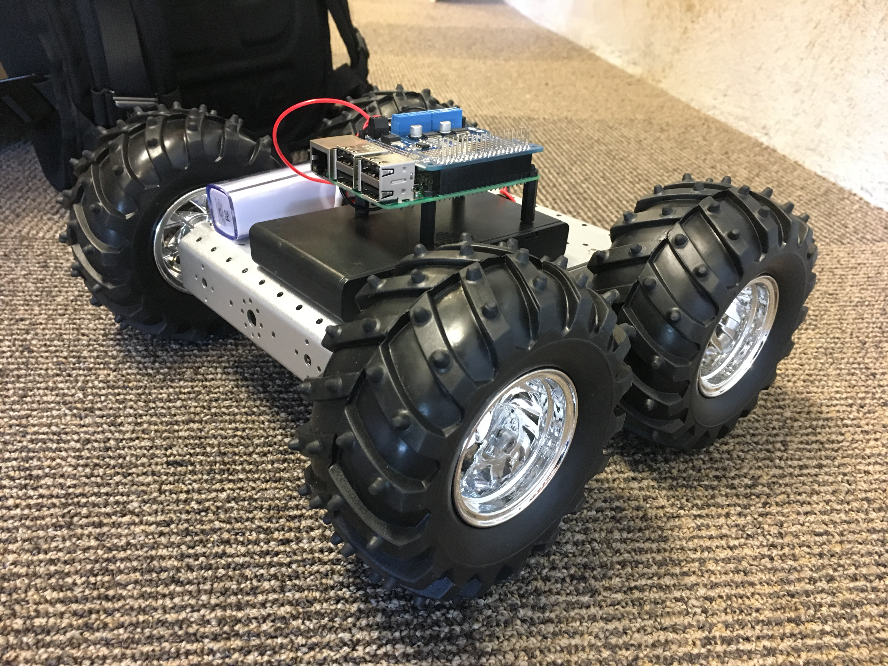

# Simple Wireless Rover for Raspberry Pi

Small robotic platform based on Raspberry Pi controlled by a remote PS4 game controller over a wireless network.

## Kickstart Guide
### 1. Install Adafruit Motor Hat in Raspberry Pi
https://github.com/adafruit/Adafruit-Motor-HAT-Python-Library.git
### 2. Start server in Raspberry Pi
`python3 robotServer.py`
### 3. Start the client on a remote machine
Connect game controller to remote machine. Configure the correct server IP on client and run `python3 client.py` on the remote machine.

`client.py -h <host> -p <port> [--verbose] [--python2]`

Use the `--python2` or `-y` option to use the pickle protocol 2 to be backward compatible with Python2 (e.g. for ROS).

### 4. Control
- **L2:** Forward
- **R2:** Backward
- **Right pad:** Spin left or right

## Hardware
- Raspberry Pi 3 with Raspbian Jessie.
- Adafruit Motor Hat https://www.adafruit.com/product/2348
- 4x 5-12V DC gear motors.
- 12V battery pack for motor power
- USB based battery pack for Raspberry Pi 3

## Files
- **client.py** UDP client that will connect the first game controller and start sending data to a predefined ip and port.
- **robotServer.py** UDP server to receive the remote game controller inputs and move the rover.
- **GameController.py** Class to handle the bluetooth PS4 game controller.
- **SimpleUDPClient.py** Basic client class.
- **SimpleUDPServer.py** Basic server class.
- **test_SimpleUDPServerClass.py** A simple test to visualize a client.
- **test_SimpleUDPServerClass_python2.py** A simple test to visualize a client.
- **SimpleUDPServer_python2.py** Downgraded to be compatible with Python2.
- **Robot4WD.py** Class to handle the robot control using Adafruit Motor Hat. https://github.com/adafruit/Adafruit-Motor-HAT-Python-Library.git
